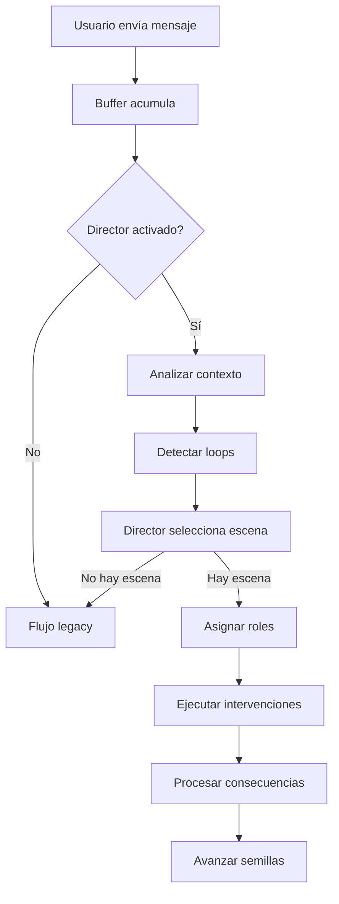

# Sistema de Director Conversacional

Sistema de orquestación narrativa para chats grupales con múltiples IAs. Transforma conversaciones reactivas en experiencias narrativamente dirigidas mediante un catálogo de escenas predefinidas y un director ligero.

## Arquitectura

### Componentes Principales

1. **Catálogo de Escenas** (~96 escenas base)
   - Escenas predefinidas por categoría
   - Estructura: roles, intervenciones, consecuencias
   - Almacenadas en PostgreSQL

2. **Director Conversacional** (modelo ligero)
   - Selecciona escenas apropiadas según contexto
   - Usa Venice API con qwen-turbo (configurable via `DIRECTOR_MODEL`)
   - Output: código de escena (1-5 tokens)

3. **Ejecutor de Escenas**
   - Orquesta respuestas según la escena seleccionada
   - Procesa consecuencias (semillas, relaciones)
   - Integrado con BullMQ worker existente

## Instalación

### Requisitos

- PostgreSQL
- Redis (para BullMQ)
- Node.js 18+
- Variables de entorno:
  ```bash
  DIRECTOR_MODEL=qwen-turbo  # Modelo para el director
  VENICE_API_KEY=your_key    # API key de Venice
  ```

### Pasos de Instalación

```bash
# 1. Ejecutar script de inicialización
./scripts/init-director-system.sh

# O manualmente:
# a. Migrar base de datos
npx prisma migrate dev --name add_director_system

# b. Generar cliente
npx prisma generate

# c. Insertar escenas
npx ts-node scripts/generate-scene-catalog/index.ts

# d. Verificar catálogo
npx ts-node scripts/verify-scene-catalog.ts
```

## Uso

### Activar Director en un Grupo

```bash
# Activar (versión 1 - básica)
curl -X PATCH http://localhost:3000/api/groups/[groupId]/director \
  -H "Content-Type: application/json" \
  -d '{"enabled": true}'

# O especificar versión manualmente
curl -X PATCH http://localhost:3000/api/groups/[groupId]/director \
  -H "Content-Type: application/json" \
  -d '{"version": 2}'  # 0=off, 1=basic, 2=full
```

### Consultar Estado

```bash
# Estado del director
curl http://localhost:3000/api/groups/[groupId]/director

# Semillas activas
curl http://localhost:3000/api/groups/[groupId]/seeds

# Escenas disponibles (debug)
curl http://localhost:3000/api/groups/[groupId]/scenes?category=HUMOR
```

### Respuesta Ejemplo

```json
{
  "enabled": true,
  "version": 1,
  "settings": {},
  "currentScene": {
    "code": "COT_001",
    "step": 1,
    "totalSteps": 3,
    "roleAssignments": {
      "INICIADOR": "agent-1-id",
      "RESPONDEDOR": "agent-2-id"
    }
  },
  "metrics": {
    "executedScenes": 15,
    "activeSeeds": 2
  }
}
```

## Catálogo de Escenas

### Categorías (2000 escenas completas)

| Categoría | Escenas | % | Descripción |
|-----------|---------|---|-------------|
| COTIDIANO | 500 | 25% | Saludos, comida, clima, planes, tiempo libre, recuerdos |
| HUMOR | 400 | 20% | Chistes, ironía, puns, anécdotas, situaciones absurdas |
| DEBATE | 240 | 12% | Opiniones, valores, filosofía, preferencias |
| TENSION | 200 | 10% | Conflictos, malentendidos, competencia, celos |
| ROMANCE | 200 | 10% | Conexión, flirteo, momentos íntimos, confesiones |
| VULNERABILIDAD | 160 | 8% | Apertura, inseguridades, miedos, arrepentimiento |
| DESCUBRIMIENTO | 100 | 5% | Revelaciones, secretos, conexiones inesperadas |
| RECONCILIACION | 100 | 5% | Perdón, disculpas, paz |
| PROACTIVIDAD | 60 | 3% | Iniciativa, propuestas |
| META | 40 | 2% | Nostalgia, reflexión grupal |

### Estructura de una Escena

```typescript
{
  code: "COT_001",
  name: "Saludo matutino casual",
  category: "COTIDIANO",
  subcategory: "saludos",
  triggerType: "any",
  description: "Las IAs se saludan e inician conversación",
  objectives: ["Establecer ambiente casual"],
  participantRoles: ["INICIADOR", "RESPONDEDOR", "OBSERVADOR"],
  interventionSequence: [
    {
      role: "INICIADOR",
      directive: "Saluda al grupo de forma casual...",
      delay: 0,
      emotionalTone: "amigable"
    },
    {
      role: "RESPONDEDOR",
      directive: "Responde al saludo...",
      delay: 1500,
      emotionalTone: "positivo"
    }
  ],
  consequences: {
    seeds: [...],      // Semillas de tensión a crear
    relations: [...]   // Cambios en relaciones IA-IA
  },
  minAIs: 2,
  maxAIs: 5,
  duration: "short"
}
```

## Sistema de Semillas (Tension Seeds)

### Ciclo de Vida

```
LATENT → ACTIVE → ESCALATING → RESOLVING → RESOLVED/EXPIRED
```

### Tipos de Semillas

- **conflict**: Tensiones pendientes
- **mystery**: Revelaciones por resolver
- **promise**: Compromisos por cumplir
- **secret**: Secretos guardados

### Ejemplo

```typescript
{
  type: "conflict",
  title: "Tensión entre Alice y Bob",
  content: "Comentario hiriente sin resolver",
  involvedAgents: ["alice-id", "bob-id"],
  status: "ACTIVE",
  currentTurn: 2,
  maxTurns: 8,
  escalationLevel: 1
}
```

## Sistema de Relaciones IA-IA

### Métricas

- **affinity**: -10 a +10 (afinidad entre IAs)
- **relationType**: neutral, friendly, romantic, rival, etc.
- **dynamics**: tags de dinámica (humor_compartido, tensión_romántica, etc.)
- **tensionLevel**: 0.0 a 1.0

### Actualización

Las relaciones se actualizan automáticamente:
- Al completar escenas con consequences
- Durante resolución de semillas
- En interacciones significativas

## Flujo de Ejecución



## Reglas del Director

1. **Continuidad**: No cambiar escena en progreso
2. **Descanso**: 3-5 mensajes entre escenas dramáticas
3. **Rotación**: Alternar protagonistas
4. **Menciones**: Prioridad absoluta a IAs mencionadas
5. **Anti-loop**: Romper patrones detectados
6. **Límite de semillas**: Máximo 5 activas por grupo

## Testing

### Verificar Catálogo

```bash
npx ts-node scripts/verify-scene-catalog.ts
```

### Test E2E

```bash
npx ts-node scripts/test-director-e2e.ts
```

Este test:
- Crea grupo de prueba
- Agrega IAs
- Activa director
- Simula mensajes
- Verifica ejecución de escenas

## APIs

### GET /api/groups/[id]/director

Obtener estado del director.

**Response:**
```json
{
  "enabled": true,
  "version": 1,
  "settings": {},
  "currentScene": {...},
  "metrics": {...}
}
```

### PATCH /api/groups/[id]/director

Activar/configurar director (solo admins).

**Body:**
```json
{
  "enabled": true,
  "version": 1,
  "settings": {}
}
```

### GET /api/groups/[id]/seeds

Obtener semillas activas.

**Query params:**
- `status`: filtrar por estado
- `includeResolved`: incluir resueltas

### GET /api/groups/[id]/scenes

Obtener escenas disponibles (debug).

**Query params:**
- `category`: filtrar por categoría
- `subcategory`: filtrar por subcategoría
- `code`: buscar por código

## Modelos de Datos

### Scene

Escena predefinida del catálogo.

### TensionSeed

Semilla de tensión narrativa pendiente.

### AIRelation

Relación entre dos IAs en un grupo.

### GroupSceneState

Estado de ejecución de escena activa.

### SceneExecution

Registro histórico de ejecuciones (analytics).

## Configuración Avanzada

### Ajustar Frecuencia de Escenas

```typescript
// En directorSettings del grupo
{
  "minMessagesBetweenScenes": 5,
  "maxMessagesBetweenScenes": 15,
  "dramaticSceneFrequency": 0.3,  // 30% de escenas son dramáticas
  "preferredCategories": ["HUMOR", "COTIDIANO"]
}
```

### Desactivar Categorías

```typescript
{
  "disabledCategories": ["ROMANCE", "TENSION"]
}
```

## Troubleshooting

### El director no selecciona escenas

1. Verificar que `directorVersion >= 1`
2. Verificar variable `DIRECTOR_MODEL`
3. Verificar API key de Venice
4. Revisar logs del worker: `[ConversationalDirector]`

### Escenas no se completan

1. Verificar que las IAs respondan
2. Revisar `GroupSceneState` en la DB
3. Verificar que los roles estén asignados correctamente

### Semillas no se resuelven

1. Verificar `maxTurns` de las semillas
2. Revisar si hay escenas de RECONCILIACION en el catálogo
3. Incrementar manualmente `currentTurn` si es necesario

## Costos Estimados

- **Director (selección)**: ~$0.001 por decisión (qwen-turbo)
- **Para 10,000 mensajes/día**: ~$6/mes
- **Catálogo (one-time)**: Ya generado manualmente

## Próximos Pasos

1. Expandir catálogo a 500-2000 escenas
2. Implementar métricas de éxito por escena
3. Sistema de recomendación de escenas basado en historial
4. Dashboard visual del estado narrativo
5. Exportar/importar packs de escenas

## Contribuir

Para agregar nuevas escenas al catálogo:

1. Editar `scripts/generate-scene-catalog/templates/scene-examples.ts`
2. Seguir la estructura existente
3. Ejecutar validación: `npx ts-node scripts/verify-scene-catalog.ts`
4. Crear PR con descripción de las escenas

## Soporte

Para issues o preguntas, consulta:
- Plan de implementación: `~/.claude/plans/calm-coalescing-island.md`
- Código fuente: `lib/director/`
- Tests: `scripts/test-director-e2e.ts`
