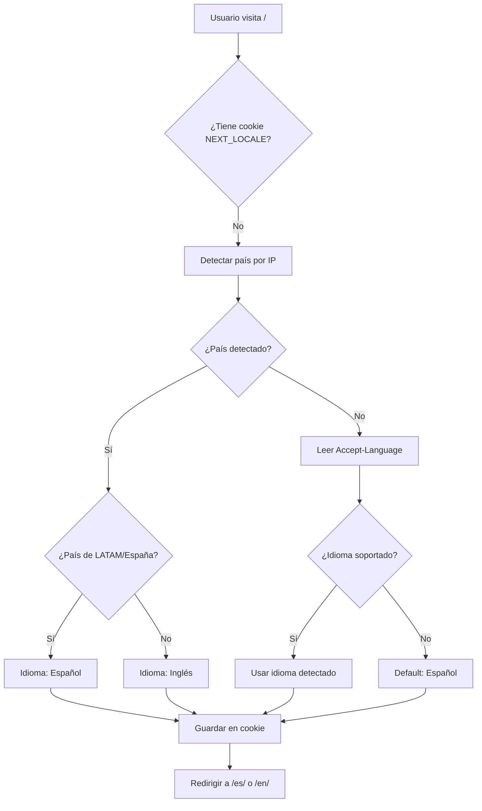
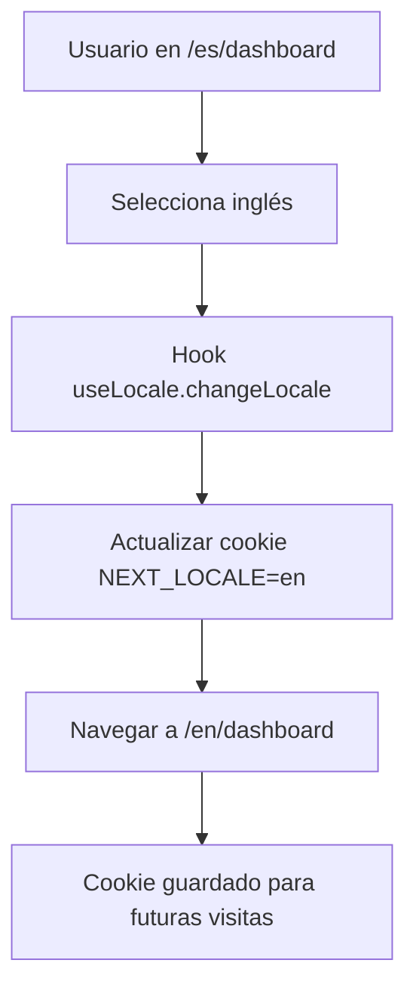

# Sistema de Detección Automática de Idioma por Geolocalización

## Descripción General

Este sistema implementa detección automática de idioma basada en la ubicación geográfica del usuario, utilizando headers gratuitos provistos por Vercel y Cloudflare. No requiere servicios externos de pago ni APIs adicionales.

## Arquitectura

### Componentes Principales

```
lib/i18n/
├── config.ts              # Configuración de idiomas soportados
├── locale-detector.ts     # Lógica de detección de idioma
│
hooks/
├── useLocale.ts          # Hook para manejar idioma en componentes
│
components/ui/
├── language-selector.tsx  # Selector de idioma UI
│
middleware.ts             # Middleware integrado (auth + i18n)
```

## Orden de Prioridad para Detección

El sistema detecta el idioma apropiado siguiendo esta jerarquía (de mayor a menor prioridad):

### 1. Cookie `NEXT_LOCALE` (Preferencia Guardada)

**Prioridad:** MÁXIMA

Si el usuario ya visitó el sitio y tiene un idioma guardado, se respeta esa preferencia.

```typescript
// Cookie automáticamente leído en middleware
const cookieLocale = request.cookies.get('NEXT_LOCALE')?.value;
```

**Características:**
- Duración: 1 año
- Path: `/` (global)
- SameSite: `lax`
- Se actualiza automáticamente cuando el usuario cambia de idioma

---

### 2. Geolocalización por IP (Headers de Vercel/Cloudflare)

**Prioridad:** ALTA (primera visita)

Detecta el país del usuario usando headers HTTP gratuitos:

#### Headers de Vercel (automáticos en deployments de Vercel)

```http
x-vercel-ip-country: AR
x-vercel-ip-country-region: Buenos Aires
x-vercel-ip-city: Buenos Aires
```

#### Headers de Cloudflare (si está detrás de Cloudflare)

```http
cf-ipcountry: ES
```

**Lógica de detección:**

```typescript
const countryCode = detectCountryFromIP(request);

// Países de habla hispana
const SPANISH_SPEAKING_COUNTRIES = [
  'AR', 'BO', 'CL', 'CO', 'CR', 'CU', 'DO',
  'EC', 'SV', 'GT', 'HN', 'MX', 'NI', 'PA',
  'PY', 'PE', 'PR', 'UY', 'VE', 'ES'
];

const locale = isSpanishSpeakingCountry(countryCode) ? 'es' : 'en';
```

**Características:**
- ✅ **100% Gratuito** - No requiere servicios externos
- ✅ **Sin configuración** - Headers automáticos
- ✅ **Alta precisión** - Basado en IP del usuario
- ✅ **Sin latencia** - Headers disponibles instantáneamente

**Ejemplo de detección:**

| País | Código | Idioma Detectado |
|------|--------|------------------|
| Argentina | AR | Español (`es`) |
| México | MX | Español (`es`) |
| España | ES | Español (`es`) |
| Estados Unidos | US | Inglés (`en`) |
| Brasil | BR | Inglés (`en`) |
| Alemania | DE | Inglés (`en`) |

---

### 3. Header `Accept-Language` del Navegador

**Prioridad:** MEDIA

Si no hay geolocalización disponible, se lee la preferencia de idioma del navegador:

```http
Accept-Language: es-ES,es;q=0.9,en;q=0.8,en-GB;q=0.7
```

**Parsing del header:**

```typescript
// Parse: "es-ES,es;q=0.9,en;q=0.8"
const languages = acceptLanguage.split(',').map(lang => {
  const [locale, qValue] = lang.trim().split(';');
  const quality = qValue ? parseFloat(qValue.split('=')[1]) : 1.0;
  const languageCode = locale.split('-')[0].toLowerCase(); // es-ES -> es
  return { locale: languageCode, quality };
}).sort((a, b) => b.quality - a.quality);
```

**Ejemplo:**

```
Accept-Language: es-ES,es;q=0.9,en;q=0.8
                 ↓
Idioma detectado: Español (es)
```

---

### 4. Default: Español

**Prioridad:** MÍNIMA

Si ningún método anterior funciona, se usa español como idioma por defecto:

```typescript
return defaultLocale; // 'es'
```

## Flujo de Funcionamiento

### Primera Visita (Sin Cookie)



### Visitas Posteriores (Con Cookie)

```mermaid
graph TD
    A[Usuario visita /] --> B{¿Tiene cookie NEXT_LOCALE?}
    B -->|Sí| C[Leer cookie]
    C --> D[Redirigir a /{locale}/]
    D --> E[Mantener preferencia]
```

### Cambio Manual de Idioma



## Headers Utilizados

### Detección de Geolocalización (Gratuito)

| Header | Proveedor | Formato | Ejemplo |
|--------|-----------|---------|---------|
| `x-vercel-ip-country` | Vercel | ISO 3166-1 alpha-2 | `AR`, `US`, `ES` |
| `x-vercel-ip-country-region` | Vercel | Nombre de región | `Buenos Aires` |
| `x-vercel-ip-city` | Vercel | Nombre de ciudad | `Buenos Aires` |
| `cf-ipcountry` | Cloudflare | ISO 3166-1 alpha-2 | `AR`, `US`, `ES` |

### Detección de Preferencia del Navegador

| Header | Formato | Ejemplo |
|--------|---------|---------|
| `Accept-Language` | RFC 7231 | `es-ES,es;q=0.9,en;q=0.8` |

### Headers de Logging y Debugging

| Header | Propósito |
|--------|-----------|
| `x-request-id` | Trazabilidad de requests |

## Estructura de URLs

### Rutas con Prefijo de Locale

Todas las rutas públicas tienen prefijo de idioma:

```
/es/                    → Home en español
/es/login               → Login en español
/es/dashboard           → Dashboard en español
/es/community           → Comunidad en español

/en/                    → Home in English
/en/login               → Login in English
/en/dashboard           → Dashboard in English
/en/community           → Community in English
```

### Rutas Excluidas (Sin Prefijo)

Estas rutas NO tienen prefijo de idioma:

```
/api/*                  → API endpoints
/_next/*                → Archivos de Next.js
/favicon.ico            → Favicon
/robots.txt             → Robots
/sitemap.xml            → Sitemap
/manifest.json          → PWA manifest
```

## Integración con Middleware Existente

El sistema de i18n está integrado **sin romper** la funcionalidad existente de:

- ✅ Autenticación (NextAuth + JWT)
- ✅ CORS y seguridad
- ✅ Rate limiting
- ✅ Logging y trazabilidad

### Orden de Ejecución del Middleware

```typescript
export default auth(async (req) => {
  // 1. Logging inicial
  log.info({ pathname, method }, 'Request received');

  // 2. Detección y redirección de idioma
  if (!hasLocalePrefix(pathname)) {
    const locale = detectLocale(req);
    return NextResponse.redirect(addLocalePrefix(pathname, locale));
  }

  // 3. Verificación de autenticación (existente)
  const isPublicRoute = checkPublicRoute(pathname);
  if (!isPublicRoute && !isAuthenticated) {
    return NextResponse.redirect('/login');
  }

  // 4. CORS headers (existente)
  if (isOriginAllowed(origin)) {
    response.headers.set('Access-Control-Allow-Origin', origin);
  }

  // 5. Continuar con el request
  return response;
});
```

### Compatibilidad con Rutas Públicas

Las rutas públicas ahora soportan prefijos de idioma:

```typescript
const publicRoutes = ['/login', '/api/auth/signin'];

// Antes: Solo /login era pública
// Ahora: Tanto /login como /es/login y /en/login son públicas

const isPublicRoute = publicRoutes.some(route => {
  // Verificar ruta sin locale
  if (pathname === route) return true;

  // Verificar ruta con locale (ej: /es/login)
  const pathWithoutLocale = pathname.replace(/^\/[a-z]{2}/, '') || '/';
  if (pathWithoutLocale === route) return true;

  return false;
});
```

## Uso en Componentes

### Hook `useLocale`

```typescript
import { useLocale } from '@/hooks/useLocale';

function MyComponent() {
  const { locale, changeLocale } = useLocale();

  return (
    <div>
      <p>Idioma actual: {locale}</p>
      <button onClick={() => changeLocale('en')}>Switch to English</button>
      <button onClick={() => changeLocale('es')}>Cambiar a Español</button>
    </div>
  );
}
```

### Componente `LanguageSelector`

```typescript
import { LanguageSelector } from '@/components/ui/language-selector';

function Header() {
  return (
    <header>
      {/* Selector completo con bandera y texto */}
      <LanguageSelector variant="ghost" showLabel={true} />

      {/* Solo icono (para móvil) */}
      <LanguageSelector variant="ghost" size="icon" showLabel={false} />
    </header>
  );
}
```

## Cookies

### Cookie `NEXT_LOCALE`

```typescript
{
  name: 'NEXT_LOCALE',
  value: 'es' | 'en',
  maxAge: 31536000,        // 1 año
  path: '/',               // Disponible en toda la app
  sameSite: 'lax',         // Protección CSRF
  httpOnly: false,         // Accesible desde JS (para cambio manual)
}
```

**Ciclo de vida:**

1. **Creación:** Primera visita sin cookie → Se crea con locale detectado
2. **Lectura:** Cada request → Se usa para determinar idioma
3. **Actualización:** Cambio manual de idioma → Se actualiza el valor
4. **Expiración:** Después de 1 año → Se vuelve a detectar automáticamente

## Logging y Debugging

El sistema registra eventos detallados para debugging:

```typescript
// Detección de país
log.debug({ country: 'AR', source: 'vercel' }, 'Country detected');

// Detección de idioma
log.info({ locale: 'es', source: 'geolocation' }, 'Locale detected');

// Redirección
log.info({ from: '/', to: '/es/' }, 'Redirecting to locale path');

// Cookie set
log.debug({ locale: 'es' }, 'Setting locale cookie for first-time visitor');

// Cookie update
log.debug({ old: 'en', new: 'es' }, 'Updating locale cookie');
```

**Ver logs en desarrollo:**

```bash
npm run dev
# Los logs aparecen en la consola con nivel INFO y DEBUG
```

## Testing

### Testing Local

Para probar diferentes geolocalizaciones localmente, puedes:

1. **Simular headers de Vercel:**

```typescript
// En tu navegador (DevTools → Network → Headers)
x-vercel-ip-country: AR  // Simular Argentina → Español
x-vercel-ip-country: US  // Simular USA → Inglés
```

2. **Cambiar Accept-Language del navegador:**

Chrome: `chrome://settings/languages`
Firefox: `about:preferences#general` → Languages

3. **Borrar cookies para re-detectar:**

```javascript
// En DevTools → Console
document.cookie = 'NEXT_LOCALE=; Max-Age=0; path=/';
location.reload();
```

### Testing en Vercel

Vercel provee los headers automáticamente en producción:

```bash
# Deploy a Vercel
vercel --prod

# Los headers x-vercel-ip-* estarán disponibles automáticamente
```

**Verificar headers en Vercel:**

```bash
curl -I https://tu-app.vercel.app
```

Respuesta:

```http
HTTP/2 200
x-vercel-ip-country: AR
x-vercel-ip-country-region: Buenos Aires
x-vercel-ip-city: Buenos Aires
```

## Casos de Uso Especiales

### 1. Usuario de Argentina visita por primera vez

```
1. Request: GET /
2. Cookie: No existe NEXT_LOCALE
3. Geolocation: x-vercel-ip-country: AR
4. Detección: Argentina → Español
5. Cookie: NEXT_LOCALE=es (1 año)
6. Redirect: → /es/
7. Response: 200 OK (en español)
```

### 2. Usuario de USA visita por primera vez

```
1. Request: GET /
2. Cookie: No existe NEXT_LOCALE
3. Geolocation: x-vercel-ip-country: US
4. Detección: USA → Inglés
5. Cookie: NEXT_LOCALE=en (1 año)
6. Redirect: → /en/
7. Response: 200 OK (in English)
```

### 3. Usuario cambia manualmente a inglés

```
1. Request: GET /es/dashboard (con cookie NEXT_LOCALE=es)
2. Usuario: Click en "Switch to English"
3. Hook: useLocale.changeLocale('en')
4. Cookie: NEXT_LOCALE=en (actualizado)
5. Navigate: → /en/dashboard
6. Futuras visitas: Siempre en inglés (hasta cambiar de nuevo)
```

### 4. Usuario sin geolocalización (VPN/Proxy)

```
1. Request: GET /
2. Cookie: No existe NEXT_LOCALE
3. Geolocation: No headers (VPN oculta IP)
4. Fallback: Leer Accept-Language: es-ES,es;q=0.9
5. Detección: Español (desde navegador)
6. Cookie: NEXT_LOCALE=es (1 año)
7. Redirect: → /es/
```

## Performance

### Impacto en Rendimiento

- ✅ **Sin latencia adicional:** Headers ya disponibles en el request
- ✅ **Sin API calls:** No se hacen requests externos
- ✅ **Edge Runtime:** Todo corre en Edge (cerca del usuario)
- ✅ **Cookie caching:** Después de la primera visita, 0ms overhead

### Métricas

| Métrica | Valor |
|---------|-------|
| Primera visita (detección) | ~0-2ms |
| Visitas posteriores (cookie) | ~0ms |
| Redirección | ~10-50ms (estándar HTTP 307) |

## Troubleshooting

### El idioma no se detecta correctamente

**Problema:** Usuario en Argentina ve inglés.

**Solución:**

1. Verificar headers en producción:
   ```bash
   curl -I https://tu-app.vercel.app
   ```

2. Verificar si existe cookie vieja:
   ```javascript
   console.log(document.cookie); // Buscar NEXT_LOCALE
   ```

3. Borrar cookie y recargar:
   ```javascript
   document.cookie = 'NEXT_LOCALE=; Max-Age=0; path=/';
   location.reload();
   ```

### El cambio manual no persiste

**Problema:** Usuario cambia a inglés pero vuelve a español al recargar.

**Solución:**

Verificar que el cookie se está guardando correctamente:

```javascript
// En useLocale.ts
document.cookie = `NEXT_LOCALE=${newLocale}; path=/; max-age=${365 * 24 * 60 * 60}; SameSite=Lax`;
```

### Redirección infinita

**Problema:** La app entra en loop de redirecciones.

**Solución:**

Verificar que `hasLocalePrefix` funciona correctamente:

```typescript
// En middleware.ts
if (!hasLocalePrefix(pathname)) {
  // Solo redirigir si NO tiene prefijo
  return NextResponse.redirect(addLocalePrefix(pathname, locale));
}
```

## Configuración de Vercel

No se requiere configuración adicional. Los headers están disponibles automáticamente en:

- ✅ Vercel Hobby (gratuito)
- ✅ Vercel Pro
- ✅ Vercel Enterprise

## Configuración de Cloudflare

Si usas Cloudflare como proxy:

1. El header `cf-ipcountry` está disponible automáticamente
2. No requiere configuración adicional
3. Funciona en plan Free de Cloudflare

## Siguientes Pasos

### Agregar más idiomas

Editar `/lib/i18n/config.ts`:

```typescript
export const locales = ['es', 'en', 'pt', 'fr'] as const;

// Agregar países para portugués
export const PORTUGUESE_SPEAKING_COUNTRIES = ['BR', 'PT'];
```

### Integrar con next-intl

Ver documentación: https://next-intl-docs.vercel.app/

### Agregar traducciones

Crear archivos:

```
messages/
├── es.json
├── en.json
└── pt.json
```

## Recursos

- [Vercel Geolocation Headers](https://vercel.com/docs/edge-network/headers#request-headers)
- [Cloudflare IP Geolocation](https://developers.cloudflare.com/workers/runtime-apis/request#incomingrequestcfproperties)
- [Next.js Middleware](https://nextjs.org/docs/app/building-your-application/routing/middleware)
- [Accept-Language RFC](https://developer.mozilla.org/en-US/docs/Web/HTTP/Headers/Accept-Language)
