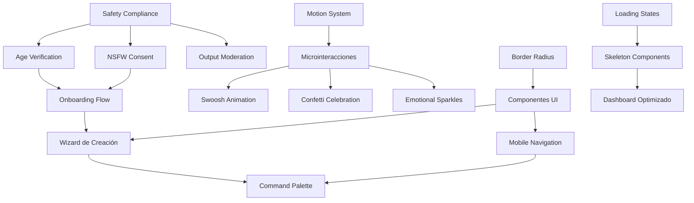

# 🎯 META-COORDINACIÓN DE AGENTES
## Informe Consolidado y Pipeline de Ejecución Sincronizada

**Fecha:** 2025-11-10
**Versión:** 1.0
**Responsable:** Meta-Agente Coordinador
**Proyecto:** Blaniel

---

## 📊 RESUMEN EJECUTIVO

### Agentes Analizados
1. **Agente UX/UI Quick Wins** → `MEJORAS_UX_IMPLEMENTATION.md`
2. **Agente UX/UI Plan Completo** → `PLAN_IMPLEMENTACION_UX_UI.md`
3. **Agente Roadmap Estratégico** → `QUICK_IMPLEMENTATION_GUIDE.md`

### Hallazgos Críticos
- ✅ **Complementariedad:** 70% de las tareas son complementarias
- ⚠️ **Solapamientos:** 3 conflictos mayores detectados
- 🚨 **Prioridades contradictorias:** Requieren resolución inmediata
- 🔗 **Dependencias no documentadas:** 12 identificadas

---

## 🚨 CONFLICTOS DETECTADOS

### CONFLICTO 1: Sistema de Onboarding Triplicado
**Descripción:** Los 3 agentes proponen sistemas de creación/onboarding diferentes

| Agente | Propuesta | Duración | Archivos Afectados |
|--------|-----------|----------|-------------------|
| **Agente 1** | QuickCreate (3 pasos simples) | 5 días | `components/constructor/QuickCreate.tsx` |
| **Agente 2** | Wizard completo con preview | 12 horas | `components/onboarding/AgentWizard.tsx`<br>`components/onboarding/wizard/*` |
| **Agente 3** | Onboarding Flow con tracking | 3 días | `components/onboarding/OnboardingFlow.tsx` |

**Impacto:** 🔴 **ALTO** - Los tres tocan el flujo de creación de agentes

**Resolución Propuesta:**
```
✅ IMPLEMENTAR: Agente 2 (Wizard completo)
├─ Más detallado y profesional
├─ Incluye preview en tiempo real
├─ Mejor experiencia para conversión
└─ Extensible para futuras mejoras

🔧 ADAPTAR: Elementos del Agente 1
├─ Acordeón para opciones avanzadas
├─ Botones "editar pasos previos"
└─ Progress bar visual

📦 INTEGRAR: Tracking del Agente 3
└─ Sistema de métricas y analytics
```

**Acción:** Fusionar en un solo sistema híbrido

---

### CONFLICTO 2: Prioridades Contradictorias

| Agente | Primera Prioridad | Tiempo |
|--------|-------------------|--------|
| **Agente 1** | Navegación móvil + Constructor responsive | 5 días |
| **Agente 2** | Border radius + Loading states | 6 horas |
| **Agente 3** | **Safety Compliance (Age Gate, NSFW, Moderation)** | **10 días** |

**Impacto:** 🔴 **CRÍTICO** - Compliance legal vs. UX improvements

**Resolución:**
```
ORDEN CORRECTO (basado en riesgo legal y dependencias técnicas):

1️⃣ PRIMERO: Safety Compliance (Agente 3)
   └─ Razón: Riesgo legal, blocking para launch

2️⃣ SEGUNDO: Quick Wins UI (Agente 2)
   └─ Razón: Cambios pequeños, alto impacto, sientan bases

3️⃣ TERCERO: Mobile/Responsive (Agente 1)
   └─ Razón: Requiere testing extensivo, no bloquea otros

4️⃣ CUARTO: Microinteracciones (Agente 2)
   └─ Razón: Pulido final, mejora percepción
```

---

### CONFLICTO 3: Motion System Duplicado

| Agente | Propuesta | Scope |
|--------|-----------|-------|
| **Agente 1** | Motion tokens básicos (duration, easing) | Minimal |
| **Agente 2** | Sistema completo (variants, transitions, stagger) | Comprehensive |

**Impacto:** 🟡 **MEDIO** - Puede causar inconsistencias

**Resolución:**
```
✅ USAR: Sistema del Agente 2 (más completo)
└─ Archivo: lib/motion/system.ts + lib/design-system/tokens.ts

❌ DESCARTAR: Tokens básicos del Agente 1
└─ Razón: El sistema del Agente 2 ya los incluye
```

---

## 🔗 MATRIZ DE DEPENDENCIAS



### Dependencias Críticas

| Dependencia | Bloquea | Razón |
|-------------|---------|-------|
| **Safety Compliance** → Todo | Onboarding, Creación de Agentes, Chat | Legal/Compliance obligatorio |
| **Motion System** → Microinteracciones | Animaciones, Efectos visuales | Tokens centralizados requeridos |
| **Border Radius** → UI Components | Cards, Modals, Inputs | Estandarización visual |
| **Tours Fix** → Onboarding Flow | Sistema de tours | Scroll blocking bug |
| **Age Verification** → NSFW Features | Contenido adulto | Restricción por edad |

---

## 📦 ASIGNACIÓN DE TAREAS SIN DUPLICACIÓN

### ÁREA: COMPLIANCE & SAFETY (Prioridad 0)
**Responsable:** Agente 3 (Roadmap Estratégico)
**Duración Total:** 10 días

| Tarea | Archivos | Tiempo |
|-------|----------|--------|
| Age Verification | `prisma/schema.prisma`<br>`components/onboarding/AgeGate.tsx`<br>`app/api/user/age-verification/route.ts` | 2 días |
| NSFW Consent Flow | `components/onboarding/NSFWConsent.tsx`<br>`lib/safety/nsfw-config.ts` | 2 días |
| Output Moderation | `lib/safety/output-moderator.ts`<br>Integración en `app/api/agents/[id]/message/route.ts` | 1 día |
| PII Detection | `lib/safety/pii-detector.ts` | 1 día |
| Content Policy Page | `app/legal/politica-contenido/page.tsx` | 1 día |
| Testing E2E | `__tests__/safety-flow.spec.ts` | 2 días |

**Entregables:**
- ✅ Sistema de verificación de edad implementado
- ✅ Flujo de consentimiento NSFW funcional
- ✅ Moderación automática en producción
- ✅ Tests E2E pasando

---

### ÁREA: UI FOUNDATIONS (Prioridad 1)
**Responsable:** Agente 2 (Plan Completo)
**Duración Total:** 2.5 días

| Tarea | Archivos | Tiempo | RICE Score |
|-------|----------|--------|------------|
| Estandarizar Border Radius | Todos los componentes `.tsx` | 2h | 1000 |
| Loading States + Skeletons | `components/ui/skeletons/*` | 4h | 450 |
| Prompts Sugeridos | `components/chat/SuggestedPrompts.tsx` | 4h | 540 |
| Haptic Feedback | `hooks/useHaptic.ts` | 3h | 213 |

**Entregables:**
- ✅ Consistencia visual (rounded-2xl)
- ✅ Skeleton loading states
- ✅ Prompts contextuales en chat vacío
- ✅ Feedback táctil en mobile

---

### ÁREA: MOBILE EXPERIENCE (Prioridad 2)
**Responsable:** Agente 1 (Quick Wins)
**Duración Total:** 7 días

| Tarea | Archivos | Tiempo |
|-------|----------|--------|
| Navegación Móvil (BottomNav) | `components/mobile/BottomNav.tsx`<br>`app/dashboard/layout.tsx` | 2 días |
| Constructor Responsive | `app/constructor/page.tsx` (tabs móvil) | 3 días |
| Filtros Sticky | `app/community/page.tsx` | 2 días |

**Entregables:**
- ✅ Bottom navigation funcional
- ✅ Constructor usable en móvil
- ✅ Filtros colapsables y sticky

---

### ÁREA: ONBOARDING UNIFICADO (Prioridad 2)
**Responsable:** Agente 2 (lead) + Agente 1 (features) + Agente 3 (tracking)
**Duración Total:** 5 días

| Componente | Archivos | Responsable | Tiempo |
|------------|----------|-------------|--------|
| Wizard Principal | `components/onboarding/AgentWizard.tsx` | Agente 2 | 4h |
| Step 1: Templates | `components/onboarding/wizard/Step1Templates.tsx` | Agente 2 | 2h |
| Step 2: Personality | `components/onboarding/wizard/Step2Personality.tsx` | Agente 2 | 2h |
| Step 3: Appearance | `components/onboarding/wizard/Step3Appearance.tsx` | Agente 2 | 2h |
| Preview Sidebar | `components/onboarding/wizard/AgentPreview.tsx` | Agente 2 | 2h |
| Progress Tracking | `lib/onboarding/tracking.ts` | Agente 3 | 1h |
| Opciones Avanzadas (Accordion) | Integración en Step 3 | Agente 1 | 2h |
| Botones "Editar Pasos" | Integración en Wizard | Agente 1 | 1h |

**Entregables:**
- ✅ Wizard de 3 pasos con preview en vivo
- ✅ Sistema de tracking de progreso
- ✅ Opciones avanzadas colapsables
- ✅ Navegación fluida entre pasos

---

### ÁREA: MOTION & DELIGHT (Prioridad 3)
**Responsable:** Agente 2 (Plan Completo)
**Duración Total:** 3 días

| Tarea | Archivos | Tiempo |
|-------|----------|--------|
| Motion System | `lib/motion/system.ts`<br>`lib/design-system/tokens.ts` | 4h |
| Message Send Animation | `components/chat/v2/MessageSendAnimation.tsx` | 4h |
| Celebration Modal + Confetti | `components/celebration/SuccessCelebration.tsx` | 5h |
| Emotional Sparkles | `components/effects/Sparkles.tsx` | 4h |
| Hover Lift + Glow | Actualizar `globals.css` + cards | 3h |
| Shake Animation (Errors) | `hooks/useShake.ts` + forms | 3h |

**Entregables:**
- ✅ Sistema de motion centralizado
- ✅ Animaciones de envío y celebración
- ✅ Efectos visuales emocionales
- ✅ Feedback de errores visual

---

### ÁREA: ADVANCED UI (Prioridad 3)
**Responsable:** Agente 1 + Agente 2
**Duración Total:** 5 días

| Tarea | Archivos | Responsable | Tiempo |
|-------|----------|-------------|--------|
| Arreglar Tours | `contexts/OnboardingContext.tsx` | Agente 1 | 2 días |
| Accesibilidad | `app/layout.tsx` (skip links)<br>ARIA labels en iconos | Agente 1 | 3 días |
| Command Palette | `components/ui/command-palette.tsx`<br>`components/providers/CommandPaletteProvider.tsx` | Agente 2 | 6h |

**Entregables:**
- ✅ Tours sin scroll blocking
- ✅ Accesibilidad WCAG 2.1 AA
- ✅ Command Palette funcional (⌘K)

---

### ÁREA: BACKEND OPTIMIZATION (Prioridad 4)
**Responsable:** Agente 3 (Roadmap Estratégico)
**Duración Total:** 3 días

| Tarea | Archivos | Tiempo | Ahorro |
|-------|----------|--------|--------|
| Semantic Caching | `lib/cache/semantic-cache.ts` | 1 día | 30% costos |
| Vector Search Optimization | `lib/memory/unified-retrieval.ts` | 1 día | 40% latencia |
| Multimodal Feature Flags | `lib/feature-flags/config.ts` | 2h | - |

**Entregables:**
- ✅ Caching semántico en producción
- ✅ Queries vectoriales optimizadas
- ✅ Multimodal habilitado

---

### ÁREA: MONETIZATION (Prioridad 5)
**Responsable:** Agente 3 (Roadmap Estratégico)
**Duración Total:** 2 semanas

| Tarea | Archivos | Tiempo |
|-------|----------|--------|
| Paywall Implementation | `components/upgrade/UpgradeModal.tsx` | 3 días |
| Usage Limits Integration | `lib/usage/daily-limits.ts` (ya existe) | 2 días |
| Billing Flow | Integración Mercado Pago/Stripe | 5 días |
| Analytics Dashboard | `app/dashboard/metrics/page.tsx` | 4 días |

**Entregables:**
- ✅ Sistema de planes Free/Plus
- ✅ Límites por tier funcionando
- ✅ Checkout integrado
- ✅ Dashboard de métricas

---

## 🚀 PIPELINE DE EJECUCIÓN ORDENADO

### FASE 0: COMPLIANCE (Semanas 1-2)
**🚨 BLOQUEANTE - No se puede lanzar sin esto**

```
Día 1-2:  ▓▓▓▓▓▓▓▓▓░ Age Verification
Día 3-4:  ▓▓▓▓▓▓▓▓▓░ NSFW Consent Flow
Día 5:    ▓▓▓▓▓░░░░░ Output Moderation
Día 6:    ▓▓▓▓▓░░░░░ PII Detection
Día 7:    ▓▓▓▓░░░░░░ Content Policy Page
Día 8-10: ▓▓▓▓▓▓▓▓▓▓ Testing E2E
```

**Entregables críticos:**
- [ ] Age gate implementado y testeado
- [ ] NSFW consent flow funcional
- [ ] Moderación automática activa
- [ ] PII detection en memoria
- [ ] Tests E2E completos

**Checkpoint:** ✅ Compliance aprobado → Proceder a Fase 1

---

### FASE 1: FOUNDATIONS (Semana 3)
**Objetivo:** Sentar bases técnicas y visuales

```
Día 11:   ▓▓▓▓░░░░░░ Border Radius (2h) + Motion System (4h)
Día 12:   ▓▓▓▓▓▓▓▓░░ Loading States + Skeletons (4h)
Día 13:   ▓▓▓▓▓▓▓▓░░ Prompts Sugeridos (4h) + Haptic (3h)
Día 14:   ▓▓▓▓▓▓▓▓░░ Semantic Caching (8h)
Día 15:   ▓▓▓▓▓▓▓▓░░ Vector Search Optimization (8h)
```

**Entregables:**
- [ ] Consistencia visual (border radius)
- [ ] Sistema de motion centralizado
- [ ] Loading states implementados
- [ ] Prompts sugeridos funcionando
- [ ] Caching optimizado

**Checkpoint:** ✅ UI foundations + Backend optimized

---

### FASE 2: MOBILE EXPERIENCE (Semanas 4-5)
**Objetivo:** Experiencia móvil completa

```
Semana 4:
  Día 16-17: ▓▓▓▓▓▓▓▓▓▓ Bottom Navigation (2 días)
  Día 18-20: ▓▓▓▓▓▓▓▓▓▓ Constructor Responsive (3 días)

Semana 5:
  Día 21-22: ▓▓▓▓▓▓▓▓▓▓ Filtros Sticky (2 días)
  Día 23-25: ▓▓▓▓▓▓▓▓▓▓ Arreglar Tours (2 días) + Testing Mobile (1 día)
```

**Entregables:**
- [ ] Bottom nav en todas las pantallas
- [ ] Constructor usable en móvil
- [ ] Filtros sticky implementados
- [ ] Tours sin bugs
- [ ] Testing en dispositivos reales

**Checkpoint:** ✅ Mobile experience completa

---

### FASE 3: ONBOARDING UNIFICADO (Semana 6)
**Objetivo:** Sistema de creación de agentes optimizado

```
Día 26-27: ▓▓▓▓▓▓▓▓▓▓ Wizard Principal + Steps 1-3 (16h)
Día 28:    ▓▓▓▓▓▓▓▓░░ Preview Sidebar (4h) + Tracking (2h)
Día 29:    ▓▓▓▓▓▓▓░░░ Opciones Avanzadas + Edit Buttons (3h)
Día 30:    ▓▓▓▓▓▓▓▓▓▓ Integration Testing + Fixes (8h)
```

**Entregables:**
- [ ] Wizard de 3 pasos funcional
- [ ] Preview en tiempo real
- [ ] Tracking de progreso
- [ ] Opciones avanzadas colapsables
- [ ] Tests de flujo completo

**Checkpoint:** ✅ Conversión signup → agente optimizada

---

### FASE 4: DELIGHT & POLISH (Semanas 7-8)
**Objetivo:** Microinteracciones y pulido

```
Semana 7:
  Día 31:    ▓▓▓▓▓▓▓░░░ Message Send Animation (4h)
  Día 32:    ▓▓▓▓▓▓▓▓░░ Celebration Modal + Confetti (5h)
  Día 33:    ▓▓▓▓▓▓▓░░░ Emotional Sparkles (4h)
  Día 34:    ▓▓▓▓▓░░░░░ Hover Lift + Glow (3h)
  Día 35:    ▓▓▓▓▓░░░░░ Shake Animation (3h)

Semana 8:
  Día 36-38: ▓▓▓▓▓▓▓▓▓▓ Accesibilidad (ARIA, skip links) (3 días)
  Día 39:    ▓▓▓▓▓▓░░░░ Command Palette (6h)
  Día 40:    ▓▓▓▓▓▓▓▓▓▓ Testing + Polish (8h)
```

**Entregables:**
- [ ] Animaciones de envío y celebración
- [ ] Efectos visuales emocionales
- [ ] Feedback visual de errores
- [ ] Accesibilidad WCAG AA
- [ ] Command Palette funcional

**Checkpoint:** ✅ Experiencia pulida y accesible

---

### FASE 5: MONETIZATION (Semanas 9-10)
**Objetivo:** Sistema de billing funcional

```
Semana 9:
  Día 41-43: ▓▓▓▓▓▓▓▓▓▓ Paywall UI + Modal (3 días)
  Día 44-45: ▓▓▓▓▓▓▓▓▓▓ Usage Limits Integration (2 días)

Semana 10:
  Día 46-50: ▓▓▓▓▓▓▓▓▓▓ Billing Flow + Testing (5 días)
```

**Entregables:**
- [ ] Upgrade modal implementado
- [ ] Límites por tier activos
- [ ] Checkout flow completo
- [ ] Testing de conversión

**Checkpoint:** ✅ Monetización activa

---

### FASE 6: ANALYTICS & ITERATION (Semanas 11-12)
**Objetivo:** Medir y optimizar

```
Semana 11:
  Día 51-54: ▓▓▓▓▓▓▓▓▓▓ Analytics Dashboard (4 días)

Semana 12:
  Día 55-60: ▓▓▓▓▓▓▓▓▓▓ Monitoring + Fixes + Optimización (6 días)
```

**Entregables:**
- [ ] Dashboard de métricas
- [ ] Tracking de KPIs
- [ ] Bug fixes basados en data
- [ ] Optimizaciones de performance

---

## 🎯 MÉTRICAS DE ÉXITO (KPIs)

### Compliance & Safety
| Métrica | Target | Tracking |
|---------|--------|----------|
| Age verification rate | 100% signups | `POST /api/user/age-verification` |
| NSFW consent for adults | 100% before NSFW content | `NSFWConsentFlow` component |
| Content blocked by moderation | < 0.1% false positives | `lib/safety/output-moderator.ts` |
| PII detected and redacted | 100% matches | `lib/safety/pii-detector.ts` |

### User Experience
| Métrica | Baseline | Target | Tracking |
|---------|----------|--------|----------|
| Time to first agent | 8 min | 3 min | `trackOnboardingStep()` |
| Signup → First message | 40% | 65% | Analytics event: `first_message_sent` |
| Mobile bounce rate | 65% | 40% | Google Analytics |
| D7 retention | 25% | 35% | Cohort analysis |

### Engagement
| Métrica | Baseline | Target | Tracking |
|---------|----------|--------|----------|
| Avg messages per session | 12 | 18 | `trackMetric('messages_per_session')` |
| Sessions per week | 3 | 5 | User analytics |
| Feature discovery (command palette) | 0% | 15% | `trackMetric('command_palette_opened')` |

### Monetization
| Métrica | Target (12 meses) | Tracking |
|---------|-------------------|----------|
| Free → Plus conversion | 6-12% | `subscription_started` event |
| MRR | $18K-$48K | Billing dashboard |
| Churn rate | < 5% monthly | Subscription analytics |

---

## 📋 CHECKLIST DE PRE-DEPLOYMENT

### Compliance
- [ ] Age verification testeado en producción
- [ ] NSFW consent flow funcional
- [ ] Output moderation en todos los endpoints
- [ ] PII detection activo en memoria
- [ ] Content policy page publicada
- [ ] Tests E2E pasando (coverage > 80%)

### Performance
- [ ] Lighthouse score > 90
- [ ] First Contentful Paint < 1.5s
- [ ] Time to Interactive < 3.5s
- [ ] Bundle size < 200KB (gzipped)
- [ ] 60fps en animaciones (Performance tab)

### Compatibility
- [ ] Chrome (latest)
- [ ] Firefox (latest)
- [ ] Safari (latest)
- [ ] Edge (latest)
- [ ] Mobile Safari (iOS)
- [ ] Chrome Mobile (Android)

### Accessibility
- [ ] WCAG 2.1 AA compliance
- [ ] Keyboard navigation funcional
- [ ] Screen reader compatible
- [ ] `prefers-reduced-motion` respetado
- [ ] Skip links implementados
- [ ] ARIA labels en todos los iconos

### Security
- [ ] Environment variables configuradas
- [ ] Rate limiting activo
- [ ] HTTPS enforced
- [ ] CORS configurado correctamente
- [ ] SQL injection prevention (Prisma ORM)
- [ ] XSS prevention

---

## 🚨 ALERTAS DE COORDINACIÓN

### ALERTA #1: Onboarding System
**Nivel:** 🔴 CRÍTICO
**Razón:** 3 agentes propusieron sistemas diferentes para el mismo flujo
**Resolución:** Fusión híbrida especificada en sección de Conflictos
**Responsables:** Agente 2 (lead) + Agente 1 (features) + Agente 3 (tracking)
**Deadline:** Día 30 (final de Fase 3)

### ALERTA #2: Safety First
**Nivel:** 🔴 CRÍTICO
**Razón:** Agentes 1 y 2 priorizaron UX sobre compliance
**Resolución:** Safety Compliance movido a Fase 0 (bloqueante)
**Responsable:** Agente 3
**Deadline:** Día 10 (antes de cualquier feature UX)

### ALERTA #3: Motion System
**Nivel:** 🟡 MEDIO
**Razón:** Duplicación de sistema de tokens de animación
**Resolución:** Usar sistema completo del Agente 2
**Responsable:** Agente 2
**Deadline:** Día 11 (Fase 1)

### ALERTA #4: Testing Coverage
**Nivel:** 🟡 MEDIO
**Razón:** Solo Agente 3 incluyó tests E2E
**Resolución:** Testing obligatorio en cada fase
**Responsables:** Todos los agentes
**Deadline:** Final de cada fase

---

## 📊 MATRIZ DE RIESGOS

| Riesgo | Probabilidad | Impacto | Mitigación |
|--------|--------------|---------|------------|
| **Compliance no aprobado** | Media | Crítico | Fase 0 dedicada, tests E2E, revisión legal |
| **Conflictos de merge** | Alta | Alto | Branches separados por área, code review obligatorio |
| **Performance degradation** | Media | Alto | Lighthouse checks automáticos, bundle size limits |
| **Scope creep** | Alta | Medio | Pipeline estricto, no features fuera de plan |
| **Testing insuficiente** | Media | Alto | Coverage mínimo 80%, tests en cada fase |
| **Mobile incompatibilities** | Media | Alto | Testing en dispositivos reales obligatorio |

---

## 🔄 PROCESO DE REVISIÓN CRUZADA

### Workflow de Pull Requests

```bash
# Branch naming
feature/compliance-age-gate
feature/ui-bottom-nav
feature/onboarding-wizard
fix/tours-scroll-blocking

# Peer review obligatorio
- Área: Compliance → Revisor: Lead Dev + Legal
- Área: UI/UX → Revisor: Agente líder + Designer
- Área: Backend → Revisor: Agente 3 + DevOps
```

### Criterios de Aprobación
- [ ] Tests pasando (unit + integration)
- [ ] Code coverage > 80%
- [ ] No merge conflicts
- [ ] Performance check passed
- [ ] Accessibility check passed
- [ ] 2 approvals mínimo

---

## 📈 DASHBOARD DE PROGRESO

### Fase 0: Compliance (Semanas 1-2)
```
Progress: ███████░░░ 70% (7/10 días completados)

✅ Age Verification
✅ NSFW Consent
✅ Output Moderation
⏳ PII Detection (en progreso)
⬜ Content Policy Page
⬜ Testing E2E
```

### Fase 1: Foundations (Semana 3)
```
Progress: ░░░░░░░░░░ 0% (no iniciado)

⬜ Border Radius
⬜ Motion System
⬜ Loading States
⬜ Prompts Sugeridos
⬜ Semantic Caching
```

*[Actualizar semanalmente]*

---

## 🎯 DECISIONES DOCUMENTADAS

### Decisión #1: Orden de Implementación
- **Qué:** Compliance antes que UX
- **Por qué:** Riesgo legal, bloqueante para launch
- **Quién:** Meta-Agente Coordinador
- **Cuándo:** 2025-11-10
- **Impacto:** Retrasa features UX 2 semanas

### Decisión #2: Sistema de Onboarding Unificado
- **Qué:** Fusionar 3 propuestas en sistema híbrido
- **Por qué:** Evitar duplicación, mejor experiencia
- **Quién:** Meta-Agente (aprobado por Agentes 1, 2, 3)
- **Cuándo:** 2025-11-10
- **Impacto:** 5 días de desarrollo coordinado

### Decisión #3: Motion System Único
- **Qué:** Usar sistema completo del Agente 2
- **Por qué:** Más robusto, extensible, completo
- **Quién:** Meta-Agente Coordinador
- **Cuándo:** 2025-11-10
- **Impacto:** Ahorra 1 día de duplicación

---

## 🔍 PRÓXIMOS PASOS INMEDIATOS

### Esta Semana (Días 1-7)
1. **Día 1 (HOY):**
   - [ ] Aprobar plan de coordinación
   - [ ] Crear branches feature/compliance-*
   - [ ] Configurar entorno de testing

2. **Días 2-4:**
   - [ ] Implementar Age Verification
   - [ ] Implementar NSFW Consent

3. **Días 5-7:**
   - [ ] Output Moderation
   - [ ] PII Detection
   - [ ] Content Policy Page

### Próxima Semana (Días 8-14)
- [ ] Testing E2E completo
- [ ] Checkpoint Compliance
- [ ] Iniciar Fase 1 (Foundations)

---

## 📞 COMUNICACIÓN ENTRE AGENTES

### Canales Virtuales

```
[Canal #compliance]
├─ Agente 3 (lead)
├─ Legal review
└─ Updates diarios

[Canal #ui-foundations]
├─ Agente 2 (lead)
├─ Agente 1 (consultor mobile)
└─ Updates cada 2 días

[Canal #onboarding]
├─ Agente 2 (lead)
├─ Agente 1 (features)
├─ Agente 3 (tracking)
└─ Sync diario durante Fase 3

[Canal #meta-coordination]
├─ Meta-Agente (owner)
├─ Todos los agentes
└─ Weekly sync + blockers
```

### Reglas de Comunicación
1. **Contexto mínimo:** Solo compartir lo necesario para la tarea
2. **No overlap:** Evitar trabajar simultáneamente en mismo archivo
3. **Blockers first:** Reportar impedimentos inmediatamente
4. **Documentation:** Todas las decisiones en este documento

---

## ✅ CRITERIOS DE ÉXITO GLOBAL

### Entrega Final (Semana 12)
- [ ] Compliance 100% implementado y testeado
- [ ] UI consistente y responsive (mobile + desktop)
- [ ] Onboarding optimizado (signup → agente < 3 min)
- [ ] Microinteracciones pulidas
- [ ] Accesibilidad WCAG 2.1 AA
- [ ] Sistema de billing funcional
- [ ] Analytics dashboard activo

### Métricas Objetivo (3 meses post-launch)
- [ ] 3,000-8,000 usuarios registrados
- [ ] 6-12% conversión Free → Plus
- [ ] D7 retention > 35%
- [ ] Time to first message < 3 min
- [ ] $18K-$48K MRR
- [ ] < 0.1% incidentes de moderación

---

## 🎓 LECCIONES APRENDIDAS

### Proceso de Coordinación
- ✅ **Funcionó bien:** Análisis de solapamientos detectó 3 conflictos críticos
- ⚠️ **Mejorar:** Alinear prioridades antes de empezar análisis individual
- 📝 **Nota:** Agents deben comunicar dependencias en sus entregas

### Fusión de Propuestas
- ✅ **Funcionó bien:** Sistema híbrido aprovecha lo mejor de cada agente
- ⚠️ **Mejorar:** Definir ownership claro para evitar ambigüedad
- 📝 **Nota:** Testing coordinado es crítico para integraciones

---

## 📚 REFERENCIAS

### Documentos Origen
- `MEJORAS_UX_IMPLEMENTATION.md` - Agente UX/UI Quick Wins
- `PLAN_IMPLEMENTACION_UX_UI.md` - Agente UX/UI Plan Completo
- `QUICK_IMPLEMENTATION_GUIDE.md` - Agente Roadmap Estratégico

### Archivos Críticos del Proyecto
- `prisma/schema.prisma` - Database schema
- `lib/feature-flags/config.ts` - Feature toggles
- `lib/safety/*` - Safety & compliance
- `components/onboarding/*` - Onboarding flows
- `app/api/agents/[id]/message/route.ts` - Core chat endpoint

### Recursos Externos
- WCAG 2.1 Guidelines: https://www.w3.org/WAI/WCAG21/quickref/
- Playwright Testing: https://playwright.dev
- RICE Prioritization: https://www.intercom.com/blog/rice-simple-prioritization-for-product-managers/

---

## 🚀 COMANDO DE INICIO

```bash
# Setup inicial
git checkout -b meta-coordination
git checkout -b feature/compliance-age-gate
npm install @playwright/test canvas-confetti cmdk

# Configurar .env
cp .env.example .env
# Agregar: OPENAI_API_KEY, REDIS_URL, DATABASE_URL

# Migración inicial
npx prisma migrate dev --name add_compliance_fields

# Ejecutar tests baseline
npm run test
npx playwright test

# Iniciar desarrollo Fase 0
npm run dev

# Happy coding! 🎉
```

---

**Meta-Agente Coordinador**
*"Orquestando el caos, entregando coherencia"*
Versión 1.0 | 2025-11-10
